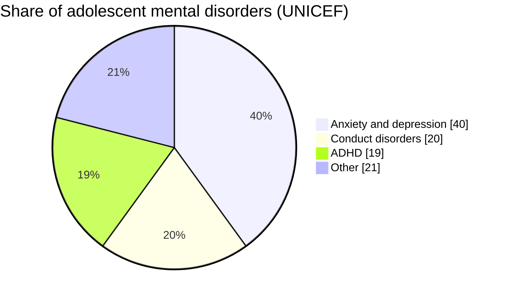
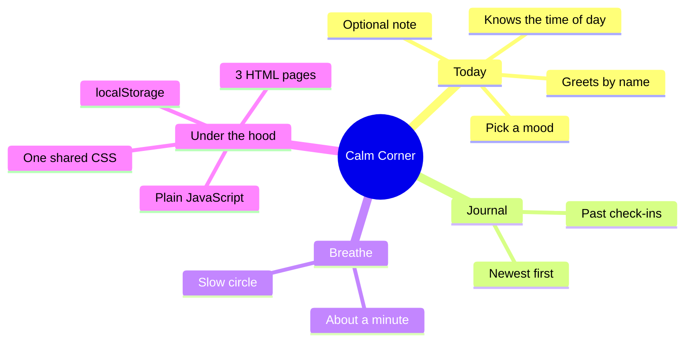

<h1 align="center">🌿 Calm Corner</h1>

  <b>A small, calm space to check in with myself.</b> 
  Pick a mood, note a thought, look back gently, and take a slow breath.

  
  
  
  
  

---

## 💭 Why Calm Corner exists

Between classes and everything else, it is easy to stop noticing how you actually feel. Calm Corner is a gentle place to pause and check in. The reason a tool this simple can matter is that young people carry a real and rising mental health load, and small daily habits of noticing are one of the low-cost things that help.

A few figures for context (sources linked at the bottom):

- Globally, about **one in seven** young people aged 10 to 19 lives with a mental health condition, roughly **15% of the disease burden** in that age group *(WHO, 2025)*.
- That is an estimated **166 million adolescents** worldwide *(UNICEF, 2019 estimate)*.
- Anxiety and depression are among the **leading causes** of illness and disability for this age group, and suicide is the **third leading cause of death** among people aged 15 to 29 *(WHO, 2025)*.

### What adolescent mental health conditions look like

None of this means a mood app is a cure. It means that noticing, early and gently, is worth building a habit around.

---

## 🪶 Why noticing helps

Calm Corner is built on a simple, well-studied idea: putting feelings into words helps you understand and manage them. Decades of research on expressive writing and reflective journaling link even a few minutes of writing about how you feel to lower stress and reduced anxiety and low mood, along with better emotional awareness *(Baikie and Wilhelm, 2005; Pennebaker)*. Calm Corner is not therapy, but it borrows that same gentle mechanism: name the feeling, note a thought, breathe.

---

## ❤️ Please read this

Calm Corner is **not a medical or diagnostic tool**, and it does not give advice or treatment. It is a personal space to notice how you feel. If things feel heavy or you are struggling, please reach out to someone you trust, or to a doctor or mental health professional. Free crisis and mental health helplines are available in most countries, and talking to a real person is always more powerful than any app.

---

## 📄 Pages

- **Today** – a daily check-in. It greets you by name, asks how you feel, and saves it with an optional note.
- **Journal** – a look back at your past check-ins, newest first.
- **Breathe** – a slow breathing circle to follow for a minute.

## ✨ What it does

- Greets you by name and by time of day
- Lets you pick a mood and add a short note
- Saves your check-ins and shows them in the journal
- A calm breathing animation to slow down with
- Remembers everything in your browser, even after you close the tab

---

## 🗺️ At a glance

---

## 🧱 Built with

- HTML (three pages that link to each other)
- One shared CSS file so every page matches
- JavaScript
- Browser `localStorage` for saving

No frameworks. I wanted to learn how to link pages together and share one stylesheet across all of them.

## ▶️ How to run it

1. Download or clone this repository.
2. Open `index.html` in any web browser.
3. Use the top links to move between pages.

---

## 🌱 What I might add next

- A soft colour that changes with the time of day
- A weekly view of moods
- A few kind quotes on the home page

---

## 📚 Sources

- World Health Organization, *Mental health of adolescents* (fact sheet): https://www.who.int/news-room/fact-sheets/detail/adolescent-mental-health
- UNICEF, *Adolescent mental health statistics*: https://data.unicef.org/topic/child-health/mental-health/
- Baikie, K. A. and Wilhelm, K. (2005), *Emotional and physical health benefits of expressive writing*, Advances in Psychiatric Treatment.

Figures are drawn from the sources above and are for context only. They are estimates that change over time, so check the linked pages for the latest numbers.

---

<i>Made by Mouparna, taking it one calm step at a time 🌿</i>

                                                                                                                                                                                                                                                                                                                    
